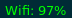

# Wifi Manager

Idle:

Show current signal strength




Changing the colors depending on the sinal strenght

Clickable:

- Give a list of networks to connect to


- If a network is selected, ask for password and try to connect


# Dependencies

nmcli

# Installation
It was designed to be used with i3blocks. Just copy the recommended configuration below into your `i3blocks.conf`

```INI
[wiFiManager]
label=Wifi:
command=bash $SCRIPT_DIR/wifi_manager
interval=5
color=#cb4b16
```
